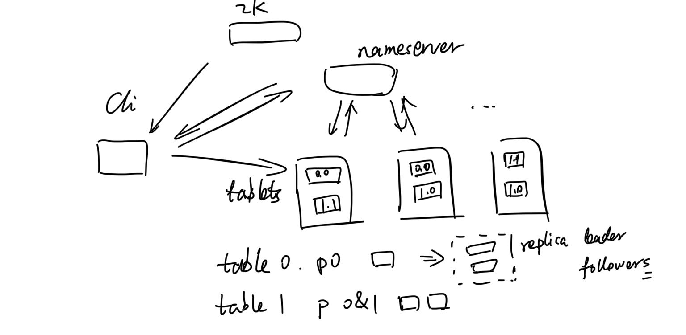
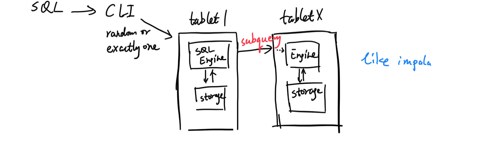

# 大概只有自己能看懂的手绘架构图

处理分布式系统好几年了，发现很多使用者最大的障碍是不懂每个组件在干什么。有的人把每个组件都想的很重要，每做一步操作都要询问是否危险，有的人把每个组件都想的很简单，每做一步操作都不会考虑后果。这两种极端都不好，所以我想通过这篇文章，把我对一些现有的分布式系统的理解分享给大家。

这些结构通常不会在官方文档中展示，因为它有点深入系统，但又没有特别深入。按理说，设计文档里应该有这样的图可以参考，但大多数系统都没有提供设计文档等细节，好像都“藏了起来”。可能又是知识的诅咒吧，会的人觉得都理解了，画图干什么，不会的人也各种原因无法抽时间看代码，参考图都是抽象的不行，不懂就永远不懂。

## OpenMLDB

五个server组件，分别是：ZooKeeper（以下简称zk），NameServer，TabletServer，TaskManager，APIServer。加上客户端，一共六个组件。我们先不管APIServer，无状态，只是特别的CLI而已，并不需要特别介绍；也不管TaskManager，它也是无状态，管理起来很简单。

架构上，我们先不管它们之间到底要做些什么，交流的具体内容是什么，只看它们之间是否会产生连接，就有下面这张图。

server之间的联系这里画的不多，不要认为它们不联系。上图主要是用户的视角，可以看到几个明显特点。
- CLI跟所有server（包括未画出来的tm和api）都有直连，区别于某些系统，它们有frontend，所有请求都要经过它。
- CLI还会跟zk联系，其实很容易想到，毕竟openmldb地址就是zk地址。一切跟集群的联系都是从zk获取某些信息开始的。
- table是分散放入tablet server的，每个分片还是多副本。副本协议暂不管。

从运维角度讲，用户需要保证：
- 组件都活着（当然，少部分掉线可能没关系，分布式的核心优势，但最终都应该恢复，掉线就靠近危险边缘了，不能就这么放着）
- tablet server上面存着数据，没有一个tablet server置身事外，所以，tablet server的storage要是正常的。tablet活着，storage不正常，该tablet还是无法服务，跟下线没太大区别。

而tablet server在意外或非意外的重启后，恢复数据是需要时间的，还有可能失败，但并不像server online/offline那么明显，很多用户会不知道有server处于正在恢复，或已经失败（但server仍然在线），直到某次使用时才发现使用出错。这就是一个常见的坑，很多分布式系统都可能发生，不过openmldb很容易出这个错，现在正在改进提示和运维方式。

用户基本不会去关心除了节点是否活着之外的其他事情，甚至节点活没活也不关心。运维角色在很多现实场景下是缺失的，也不能期望用户每次请求前都看下集群是否正常，所以，正规的话应该有“运维角色”，有报警机制，确保集群正常工作，不正常时会告知业务。如果运维不完善，就只能让用户更加容易获取集群状态，也就是事后的补救了。

### SQL查询

组件在具体某个操作，某种请求下，各自扮演的不同角色，这不是组件架构图能体现的。所以，我们再画一张SQL查询的路线图。

类似impala，每个server都可以是一次SQL的主要负责人。当tablet1需要别的tablet上的数据时，是通过subquery找别的tablet查询的，走过engine去storage获取。也就是一个sql会被拆成多个task，有些事情可以在别的tablet上做，就在那边处理好了再返回。可以想象一种最简单的情况，直接从别的tablet获取原始的数据，然后，负责的tablet1里做全部的计算。这个要看SQL计划和SQL Engine的优化，具体不详谈了。

### admin

Admin操作，例如增删表，增删deployment等等，也不是单点的，毕竟这是个多组件的集群。通常的情况是，CLI发送操作给nameserver，nameserver如有必要，会发送命令给所有tablet server，成功后再在自己本地操作，还可能写操作log到zk。

可以看到，参与者很多，而且各处都可能有元数据，有些操作又是异步的，某一个点失败了也可能无法回滚。所以，有时候还会发现元数据匹配不上，分布式的痛，只能具体问题具体分析了。
