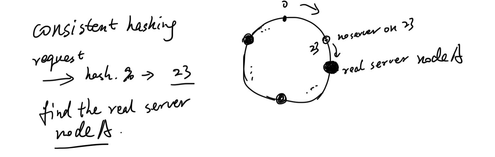
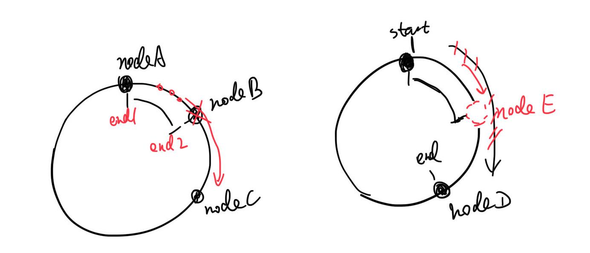
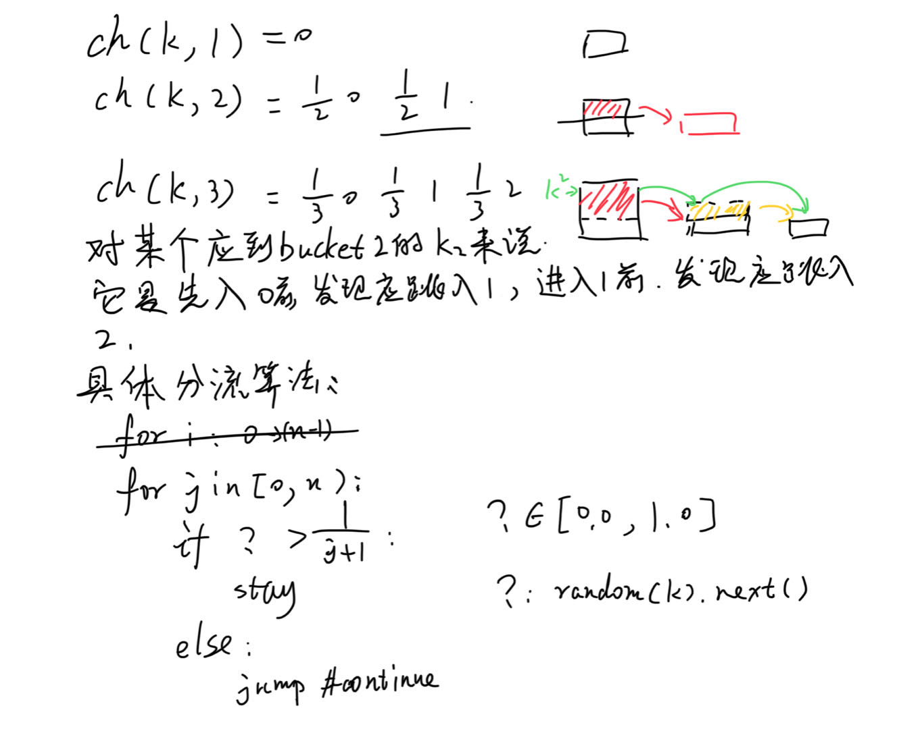
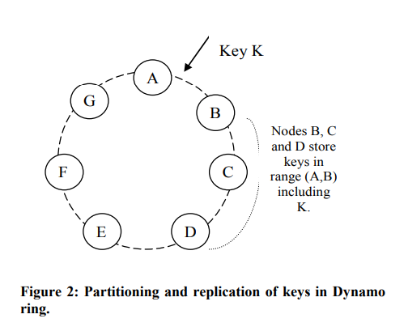
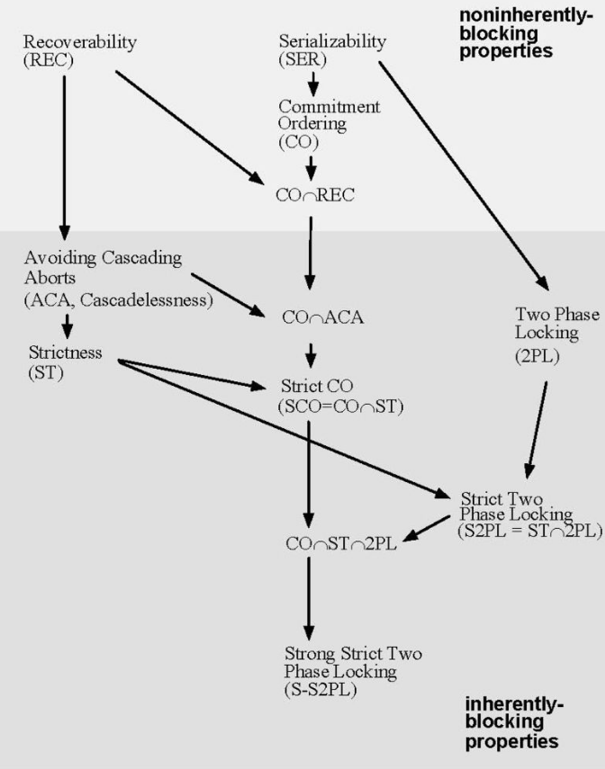
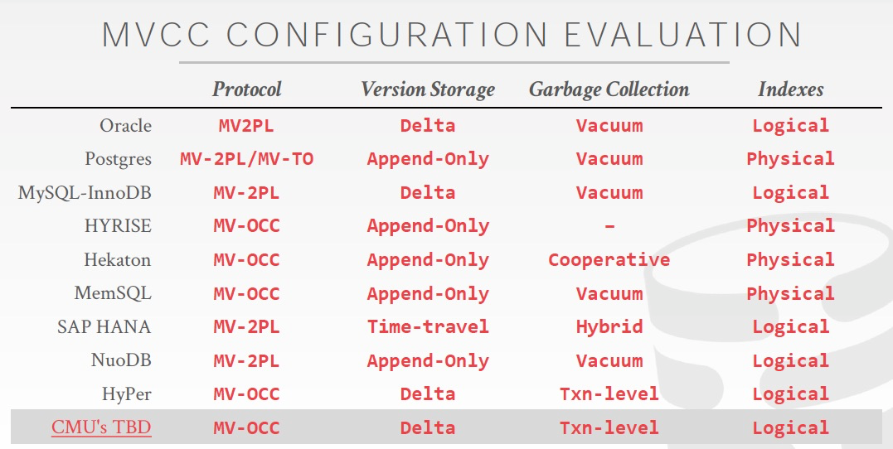
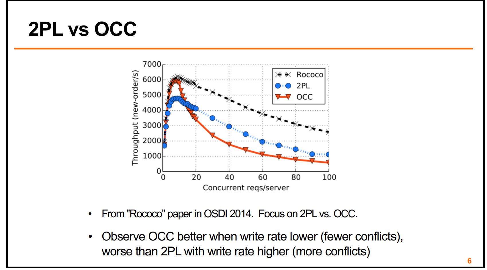

一些通用的大数据、分布式等方面的算法总结。单独出一篇文章，因为这类算法都是通用的，但具体到各个系统，实现方式可能不同，本篇只总结算法思想，可能伪代码实现最基础的算法，必要时会给出现实系统的参考链接。

## 一致性哈希

哈希可以说是出现在大数据的方方面面了。一到切分，基本都是它。一致性哈希，先说哈希，也就是虚拟哈希空间，有2^32个片，叫哈希环。

然后哪个服务器负责处理哪些哈希片，是靠映射。具体方法没有规定，比如，可以用服务器ip来hash，还是2^32取模，得到的数字，它就处理哈希环上对应的片。数据来了先hash取模，得到的值然后顺时针找可以服务的服务器，就发给它。



如果中间某个服务器down了，反正算法是往后找到第一个服务器，它还是会被处理。当然这个就要求“数据可以被任何server处理”，不能是特别的。比如，相关数据只在某个节点，其他节点获取不到，处理条件都不满足。当然这是理想条件，现实很多也不满足，但它们涉及到的数据也可以是多节点都存有备份，但又不至于所有节点都需要。这个也等于缩容，受影响的数据是“会落到这一下线节点的数据”，我们称为nodeB，将前一个节点nodeA的末尾片记为end1，当前节点末尾片为end2，也就是`(end1, end2]`区间的数据原本应该找这个节点B，但它下线了，就会变成去找下一个节点nodeC。其他片上的数据不会受到影响。虚拟哈希环不会改变大小，永远的2^32片。如下图左边所示。

而扩容就在hash环上加一个node，原本`[start, end]`会找nodeD，你在nodeD前面塞了个nodeE，那么`[start, nodeE_end]`这部分数据就是受影响的数据，原来要找nodeD，现在变成nodeE。如下图右边所示。



优点不难猜测，节点上下线只会影响局部数据，这已经是很大的优点了。不能傻到还在N个节点，就hash(req)%N吧，增加节点你还需要把N改成N+1。而且它会改变很多请求的路由，缓存都不无法利用。（当然，要是系统就是这样的简单，啥也不要求，那也不用考虑改变了，简单就是最好的。）

但这还有优化空间，因为在前面所说的算法中，nodeX总是要分到连续的多片，现实中是很难保证每片都差不多热度，也就更不能要求每个node的请求都是均匀的。而且节点数量改变时，在现实条件下，上下节点是要改变很多东西的，可能你要将一些数据复制到节点中才能正常服务，也叫做Node rebuilding。它是一个很重的操作。

为了解决，又引入“虚拟节点机制”，就是hash环上不是物理server node，而是每个物理server都膨胀出，node0-0、node0-1等等的虚拟节点，这样虚拟节点打散分布在hash环上，倾斜可能性就小些。不再是一个node去处理连续的一大片区域。如下图所示。


向图中展示的一样，一个server node处理离散的几个片，那么每个server的负载均衡就很好操作了，比如，我可以让1个server服务3个高热度的，其他server负载10个低热度的。不用费心去在环上取一个很好的位置，才能把连续的几片服务好，有变化时更是运维难度大。而迁移片也是只对这么一个小区域，粒度更细，rebuild压力也就越小。

也有人说Vnodes负载均衡的情况还可能是让性能好的机器服务更多、更热的片，小机器就混一混。机器规格不一致的时候，确实是个好处。不过我实际在工作中挺难看到不一样的机型在同一个集群。可能现在机器越来越便宜了吧，以前还是很看重成本的，甚至看到机器闲置会进行降级。

整个算法知识都可以看文章 https://interviewnoodle.com/how-to-use-consistent-hashing-in-a-system-design-interview-b738be3a1ae3
，讲的很细，图都是引用的它的。

现在来讲讲如何代码实现一致性哈希。

### 简版

简单版本，我们只做哈希环，然后node负责连续分片。
```python
def hash(key):
    return hash(key) % 2^32

map<hash_value, node> ring
# map key可以不是范围，而是end分片，这样可以用lower bound来找到第一个大于等于req_key的node
# 但原生Python不支持，得新建class
# Java ceilingEntry和C++ std都可以直接用

def get_node(key):
    hash_value = hash(key)
    return ring[lower_bound(hash_value)]

# main
req_key = hash(req)
node = get_node(req_key)
node.handle(req)
```

如果存在一群相同元素，那么 lower_bound 和 upper_bound 就可以找到这群元素的上下界限，前者指向下界限，用 lower 表示，后者指向上界限的后一个位置，用 upper 来表示。也就是说，lb是大于等于key的第一个元素，ub是大于key的第一个元素。


### 开源实现

#### Guava consistentHash

Guava库中的[com.google.common.hash.Hashing.consistentHash](https://github.com/google/guava/blob/f491b8922f9dc8003ffdf0cbde110b76bcec4b6e/guava/src/com/google/common/hash/Hashing.java#L660)就实现一致性哈希算法。一般使用方法是，你有一个key，用Hashing中提供的某种hash算法来hash这个key（比自行提供hashCode会好，提供了murmur之类的算法），得到的HashCode去调用consistentHash方法，再加上一个bucket数据限定，就可以得到一个bucket的index，也就是说，你的key会被分到这个bucket里。

但仔细看它的consistentHash函数，它压根儿没做一致性哈希理论的那些事，完全没有哈希虚拟空间的事儿。

它的理论是源于此文章 https://dl.acm.org/doi/10.1145/258533.258660 ，一致性哈希的根本定义是“对所有的 Buckets 和 Items 应用相同的哈希函数 H，按照哈希值的顺序把它们排列到一条线上，然后将距离 Bucket 最近的 Items 都放入该 Bucket 中”，哈希环是一种实现方式，但不是唯一的实现方式。

Guava一致性哈希算法实现者的文章，https://arxiv.org/ftp/arxiv/papers/1406/1406.2294.pdf ，批斗了一波原版，提出了新的“jump consistent hash”，不用存server/bucket服务哪些哈希片，速度还快。但它是有条件限制的，buckets必须是连续，否则这个index刚好是下线了的node id，那肯定不行。如果要用这一套，必然是得把bucket抽象化，也就是Vnodes那一套。

先只看JumpConsistentHash。首先，先抛弃一致性哈希的经典哈希空间，抛弃空间与真实bucket的对应关系，我们只去想这个算法要干什么，就是想将input放进bucket里，想均匀地放，当然也不能乱放。不乱放是指，key=k1，那么k1在bucket数目恒定时，就应该永远被放入同一个bucket，不然就是随意乱放了，random放，更甚者循环放就行了。

规律总结就是，记`ch(key, bucket_size)`为一致性哈希函数，那么得有：
- ch(k, 1)=0，即所有key都放bucket0，毕竟总数只有1个bucket
- In order for the consistent hash function to balanced, ch(k, 2) will have to stay at 0 for half the keys, k, while it will have to jump to 1 for the other half. In general, ch(k, n+1) has to stay the same as ch(k, n) for n/(n+1) of the keys, and jump to n for the other 1/(n+1) of the keys.
ch(k,2)，就是分一半流量给新增的bucket1。进一步的，ch(k, n+1)对比ch(k, n)则是，n/(n+1)的key完全不变化，1/(n+1)的key，它们的bucket变更成n。（必须n/(n+1)部分是完全不变化，bucket值都不可改变，不然就算不得一致性哈希了，就是随便乱来算法。）而既然是最后还是要key平均进入bucket，当然是得每个bucket里抽出一部分来，放进新bucket。

这样，就可以用ch(k,n)来描述ch(k,n+1)了。也就是说，ch(k,n+1)计算时，都是先用ch(k,n)计算出来，但有一部分key应该考虑分给新bucketn。从一个key的角度来看，它就是在不断jump，它在ch(k,1)时，就是0，然后在ch(k,2)时，就是0或1，满足条件，它就应该到1那儿去，然后在ch(k,3)时，它又该考虑是留在bucket1还是跳到bucket2，以此类推。还真是名副其实的jump。



图中，从左下框架上来看，只有?函数安排合理，就能得到一个非常简单的一致性哈希算法实现。那么，关键又变成了什么样的函数才能做到。假设k2是输入key，返回值是恒定的0.1，那么2个桶，它就会被判定去桶1，3个桶就去桶2。但这么就搞得只有小key才会挪动，不够随机。所以这里的函数一般是随机函数，但由于我们必须保证原则“bucket数量不变时，k应该对应唯一一个bucket index”，所以这个随机不是真的随机。所以实现上，会拿key本身作为seed，它对应不变的一组数字序列，是可预期的。所以对一个key来说，在bucket总数不变时，结果是一样的。

文中还做了进一步优化，大概是能跳过一些没必要的j loop，毕竟j越大，能跳的值就越少了，有些都不太需要处理这一遭。没有仔细看，有空再啃一下原文，可以参考 https://zhuanlan.zhihu.com/p/625123381 看一看。

#### Ketama

前面那个属于邪教了，课外读物，当然很厉害。真的去实现理论算法的，较为有名的一种实现叫Ketama算法，该算法最初是由Last.fm的程序员实现的并得到了广泛的应用

标准ketama好像是 https://github.com/RJ/ketama ，只有c实现，其他语言都是调用c库。本质没什么特别的好像，可能就是较早的广泛的算法实现。

https://github.com/ultrabug/uhashring 是纯Python实现，其中也包含ketama。特点是，中途可以加减node，还有weight，weight就是大的vnode多一点，这样key会较多的到weight高的node上。这一版实现值得多看看。

#### redis（其实并没有）

redis常有人说用到了一致性哈希，具体是说redis cluster的data sharding。但作者明确指出它的slot sharding不是一致性哈希，https://redis.io/docs/management/scaling/。我们来分析下。

首先redis cluster data sharding的Hash槽就少一点，当然这不是拒绝被称为一致性哈希的理由。再就是一个redis node也是负责一堆slot，也可迁移slot，类似Vnodes，但不是Vnodes就一定是一致性哈希。因为redis cluster是让一个node服务一个slot，并没有当前node下线，就可以自动找下一个node的机制。因为node有存储，不是缓存，不天然满足一致性哈希的理论要求。但它倒确实是满足了“增删节点只影响一部分数据”这一条准则，让人觉得这就是一致性哈希才能做的事情。但还是要抓重点，**redis cluster并没有为了做到能让下一个node服务，让nodeB多hold一份nodeA的存储数据**。从这个角度看，它只是hash，很多分布式存储都哈希分数据，但它们也没谁说是用了一致性哈希。
```
HASH_SLOT = CRC16(key) mod 16384
```

redis的client jedis倒是用了一致性哈希，client/proxy端做请求分流，还是很简单的。

#### Dynamo

更标准的在存储端使用一致性哈希的例子，应该是Dynamo, 原文是《Dynamo: Amazon’s Highly Available Key-value Store》。再对比下Redis cluster和Dynamo，它们在哈希存储时，都面临存储node下线后就无法服务的问题，必然得想解决方案。最常规的办法是，为每个slot做一个多副本备份，slot副本之间用某种一致性协议保证数据同步。redis cluster也是如此，所以是master/slave机制，选主由外部服务sentinel负责。所以redis cluster架构其实就是普通分布式，当然它还有个特点是，用gossip协议组成集群，而不是中心化管理集群，实际工程上用起来贼难用。不管怎样，redis cluster是非常常见的hash shard+replica的分布式存储架构，只是具体选型有序别而已。

而Dynamo不一样，它硬是一条路走到底了。原文 https://www.allthingsdistributed.com/files/amazon-dynamo-sosp2007.pdf 。解读可以看 https://medium.com/@adityashete009/consistent-hashing-amazon-dynamodb-part-1-f5719aff7681 的系列文章，Vector Clocks，Sloppy Quorum等很多细节还没看。



可以看到，它真的贯彻了一致性哈希的思想，为了能在B节点挂了的时候，能继续服务，让B之后的数个节点都放数据备份。或者看下面这张更细致的图：


Dynamo也用到了Vnodes，但还是那句话，Vnodes是一个单独的机制，不是一致性哈希的核心，不影响上图的核心思想，所以Dynamo可以说是使用了一致性哈希的。

```{tip}
> when a node is removed, the next node (moving clockwise on the ring) becomes responsible for all of the keys stored on the outgoing node.

ref https://www.educative.io/answers/how-data-is-partitioned-in-dynamo

是一致性哈希的最核心思想，也是最重要的特点。
```

## 消息队列

消息队列的逻辑，就是做和内存队列一样的事。但它的使用场景，是分布式的。也不会是单一角色的，都分布式了，所以涉及多角色（或者说多进程）。于是，基本都会抽象为，producer发消息给它，consumer去从它那里获取消息。为了保证可靠和堆积，消息会被MQ持久化。MQ的核心是Queue，也就是FIFO。至于producer有几个，consumer有几个，consumer是pull还是被push，都是具体设计的事情。队列消费，听起来，一个消息按理应该只被一个consumer拿到，消费成功后，就会被删除。但实际也会有变种，有MQ不断发展，加新功能的，不会特别死板。

一个较简单的mq工程可以参考 https://github.com/zeromicro/go-queue 。注意它是封装者，核心不在它这里，比如它底层接Kafka。

### 实现

#### RSMQ

真的MQ算法实现，RSMQ是一种经典方案，简单，具体实现有不少项目。可以看看这个 https://github.com/mlasevich/PyRSMQ 。

> One simple implementation of a message queue is using Redis. There is a Python implementation of Redis Simple Message Queue (RSMQ) called PyRSMQ . RSMQ emulates Amazon's SQS-like functionality, where there is a named queue that is backed by Redis. Once the queue is created, producers can place messages in the queue and consumers can retrieve them .

Here's an example of how you can use PyRSMQ to implement a simple message queue:

```python
from rsmq import RedisSMQ

# Create a new instance of RedisSMQ
queue = RedisSMQ(host="localhost", port=6379, qname="myqueue")

# Create a new message in the queue
queue.sendMessage().message("Hello World").execute()

# Receive the next message from the queue
msg = queue.receiveMessage().execute()
print(msg['message'])

# Delete the message from the queue
queue.deleteMessage(id=msg['id']).execute()
```

这个项目是将redis作为远程存储，同时利用redis的一些功能，去实现一个MQ，不是简单的使用者。

#### Kafka

这是最经典的工程实现了吧，值得多研究研究。

一个队列的基本定义里就应该是有序，不过Kafka并非专注于MQ，它本质是一个分布式事件流平台。这一点要注意，Kafka只是可以用来搭建消息队列，但不是只能做这个。那么事件流和消息队列为什么是两个概念呢？比如，kafka里的一个topic其实也就是一个message queue了，为什么感觉名字差距很远？事件流为何不叫作扩展版的消息队列？

这个问题，我的理解是一个中间件，上下游同样都是生产者和消费者。生产消费者数量可以是多个，这不是什么难点。所以，没必要觉得MQ的consumer只能是一个，概念不至于这么僵硬。但它们对待输入的message的态度是不一样的。

消息队列注重的是传递消息，满足Message Queueing Pattern，通常保证exactly once。它从描述上就更像是P2P的东西，你一份消息传给多个消费者，感觉就像是消息被复制了一样，所以看到很多地方对MQ的定义就是单消费者，我认为单消费者MQ是经典案例，但不是多消费就被逐出MQ了（没有MQ内核，丢失了MQ的精神，joke）。MQ中，消息本身是用完就扔了，即使有一定backup，也不太可能设计为永久存储，存也不是MQ**必须**去做的事情，不然它叫什么队列呢，叫数据库好了。当然，真有人在MQ里保存永久消息也不是违法的，不必认为MQ就不可以干更多的事。

Message Queueing Pattern更多的是和Pub-Sub Pattern对立，Pub-Sub的不一样就在于，所有订阅者都应该拿到所有消息。它描述的就是MQ所不包含的一种模式。

而流streaming就是满足Pub-Sub Pattern的，这里最好不要把流当成“流水”那个意思，感觉好像也是水流过就走了，没留下什么。streaming是会将消息记录下来的，它像是log，它要记录下所有event。当你在某个时刻才加入一个消费者时，它也可以获得全部的event。我们谈到streaming，它就应该做得到。如果是MQ的设计，要存下所有message，就不是很像queue了，你不能去要求所有MQ系统都给你这样的功能。如果你就想MQ补充这一功能，那也OK。

streaming通常被说带有实时的意思，我感觉并不是，real-time streaming才是。参考 https://sqlstream.com/real-time-vs-streaming-a-short-explanation/，streaming更多是在说它是源源不断的，持续生成，看不到尽头。区别于batch，是一个批次被处理（每条消息都看作一个batch，谁又能说streaming不是batch呢，joke again。这些概念可能没有那么泾渭分明，那也可能是我理解不够深刻）。事件是源源不断地产生，这就叫做event streaming。

所以，这两个概念可以说是没啥关系，不是非要取分出个所以然。听到某个系统是MQ，你就知道它会给你MQ基本的功能，但它可能还有更多的扩展，它可能做到更多的事情，能当流用，也可能因为它的具体设计，它其他啥也做不到了，但它就是很好用、很适合你的MQ。

https://kafka.apache.org/intro 官方文档也介绍了Kafka一般的使用场景，反正满足要求你就可以用。Kafka的topic可以pub/sub，所以，就可以拿Kafka作为MQ的底座。

##### 架构与有序

Kafka架构上就是可以给topic分区，每个partition也可以有多replica，几乎等于分布式db的架构。也正因此，各个partition之间是无法有序的，就像分布式db中按hash分片的table一样，不能天然支持range scan。单partition当然可以做到有序，不过，能放开限制自然是放开更好，能利用上分布式的优势，并发、容灾等。

TODO kafka log设计

## Log

万物基于log，log门。

https://engineering.linkedin.com/distributed-systems/log-what-every-software-engineer-should-know-about-real-time-datas-unifying
作者提倡把log作为一种抽象的概念，就像我们谈到hash，不会去具体讨论它是murmur hash还是别的。我们就把log作为一个已知的概念，不去讨论它是什么，而是去讨论它能做什么。
> So a log, rather than a simple single-value register, is the more natural abstraction.
Log可以表示`a sequence of requests`，也可以说是changes，它是一种很符合现实的抽象概念。程序基本都是在跟持续的请求打交道，而不是单一的请求。单一的，比较简单的例子就是数学计算，与别的无关，没有状态，只要给我同样的输入，我就会给同样的输出。还有cache，我就是只get/set，先到先得。但现实中，基本不是这么简单的情况。

拿Table和Log的关系来分析，Table是当前瞬间的状态。而Log是一个序列，包含了所有的变化，也可以说，它保存了所有的历史版本。历史版本，就让人很容易联想到source code version control，每个commit并不是记录当前的所有code，而是记录change。

介绍三个方向，分别如何使用log：
Data Integration—Making all of an organization's data easily available in all its storage and processing systems.
Real-time data processing—Computing derived data streams.
Distributed system design—How practical systems can by simplified with a log-centric design.

- Data Integration
  类比马斯洛的金字塔需求模型，data就是最底层的需求。（开始玄学，但确实也没说错。）许多现实系统中，其实data就没准备好，Data Integration做的差，就在此基础上搭分析、建模等模块，和搭房子一样地基不稳。
  Data Integration为什么难，作者认为是两个趋势导致的，一是event data井喷，二是data system变得非常专用。第二个好理解，很多现实场景遇到的挑战，已经不是某个data system可以解决的了，所以出现了很多细分的领域和功能各有优劣的system，例如，olap，oltp，online，batch，streaming，graph等等。第一个event data的话，我理解不深，目前的理解是event data区别于entity data，它描述的是事件、行为，而不是某个东西的最终样子，例如某时刻的点击，某时刻的登录，而entity data例如用户名、id、地区，更静态。如此区分data，主要还是没有万能的银弹，区分后会更适合去处理它们。而单独划出来的event data，传统的DB很难撑住，也就诞生了更多品种。如今的data system确实是相当多，无法将它们视为一个整体，经常要去处理它们谁流到谁那儿去的问题。

  而不同data system如何同步数据？都可以抽象为log-structured data flow。Data Source将数据变化写入log，其他data system作为subscriber，读log并自己追上数据变化。无论subscriber是哪种system，这个模型都是行得通的。就算subscriber是个cache，它实际并不存log，但它也可以通过log来同步数据。而且，log自带版本概念，可以很清楚的知道自己从这些subscriber中读取的是不是最新数据。还有一点是，log可以当作是buffer，不同subscriber消化数据的速度是不同的，也可能在某个时刻，subscriber down了，那么log还在，重启后也能追得上。从图上也可以看到，log是一个用来解耦的概念，subscriber只需要懂log，它不需要知道Data Source长什么样，这也是一个优点。
  
  

  在作者公司linkedin中，实际的场景就是
  
  通过Log，架构变为
  
  非常简洁的架构，也可以看出Log抽象的价值。（其实这也就是kafka的简要架构图了。）

  在这样的架构基础上，实际还有一些点需要考虑，就是ETL，数据并不一定是都有意义的，结构可能不是统一的，很多场景里ETL（cleanup or transformation）后的数据才值得使用或存储（存入数仓）。ETL后的数据还是一样要考虑到subscriber可能是batch的数仓，也可能是实时的什么系统。前面的架构图看不出具体的角色，所以我们应该用下面这样的详细一点的图：
  

  图中有三种角色，publisher，log system，consumer，ETL放在三个角色的哪个中，都是有说法的。具体情况具体选择，比如，数据肯定不需要被consumer收集的，就应该在publisher处直接扔掉，也就是cleanup，没必要走接下来两步。有些数据是否被consumer收集，需要看它的值，那它们肯定存在于log内，只是有些流不会传出它们，相应的consumer也就接收不到。也有些操作可能只能在consumer端做，比如针对consumer背后系统的aggregation，其他系统都不需要这一阶段，那肯定得它独自增加。

  Scalable Log，实际为了做到多subscribers，没有那么简单，所以他介绍了kafka log的设计如何满足scalable。暂时不看了，后面读kafka再说。TODO
  
- Real-time data processing
  > Stream processing has nothing to do with SQL. Nor is it limited to real-time processing.

  Yes，俺也一样，我也觉得real-time和stream并非绑定关系。
  > I see stream processing as something much broader: infrastructure for continuous data processing. I think the computational model can be as general as MapReduce or other distributed processing frameworks, but with the ability to produce low-latency results.

  batch和stream的概念，他也举了个例子，US人口普查，人口统计是下到挨家挨户统计，记录在纸上，然后this batch of records传到中央，中央把全部加起来。它不是每个地区都有a journal of births and deaths，用它来算当前人口，甚至能算到某一年的人口。这不是说journal形式就很优秀，而是各有各的区别。有些数据就是batch进来的，你就应该batch处理，有些数据就是continuous feeds，那肯定就想要能够能平滑地处理连续数据，而不是转为batch。这是自然的应对方式，当然，如果分析下来，batch没什么不可以，那也可以batch处理。要平滑处理数据，还有就是，不可能数据1s来一条，你stream处理它花5s，来不及消化的数据能堆积到明年，所以stream通常是要求low latency的。

  Log在real-time data processing中怎么工作的，进一步可参考https://samza.incubator.apache.org/learn/documentation/latest/core-concepts/core-concepts.html。他聊到了Data flow graphs，Stateful Real-Time Processing，Log Compaction

- Distributed system design
  > The final topic I want to discuss is the role of the log in data system design for online data systems.

TODO 为什么分布式一致性协议全都是需要log？它们不考虑整个table原地修改？这个话题还是分布式协议再讲。paxos multi-paxos raft这些。
附加一个paxos参考 https://zhuanlan.zhihu.com/p/341122718 

## 分布式锁

锁的概念不多赘述，分布式锁当然是分布式里用的锁，语义是一样的。举个例子，分布式中同一个角色有多个时，它们很可能需要协调谁可以写，另外的人此时不要动。每个人都觉得自己该写，那当然要一个第三方角色，来觉得谁能谁不能，要达成共识。常见分布式锁的实现是基于数据库，基于Redis，基于zk的。

TODO 为啥有个印象，有消息队列做分布式锁？
估计是经常有人说redis实现这两个
以及消息队列会用到锁

现实考虑，已有消息队列时，利用它可以不用加其他的依赖。

但mq的分布式锁是有限制的？模型如果是msg发送，收到msg的认为自己是主，那么msg定时发送的话，下一次的主就不一定是当前这个。如果是利用sub订阅的排他性？只有一个consumer能连通，其他consumer都在等着，那倒是可以。

[这篇文章介绍的redis做分布式锁](https://mp.weixin.qq.com/s/RViDM1WHE61SDLNKzUmTAg)，也有redlock和zk的一些理解，还提到大佬对redlock的讨论，读一读

## MVCC TODO merge draft

MVCC 是经典题目了，把它当八股文来记，感觉非常悬浮。我曾经说出过，每行多增加两列，但两列怎么运作的，都讲不清楚。原因当然是并未理解，连推演都没有很深刻。但 MVCC 经历了很久，1978年便被提出，现在主流的DB也都有它的实现，还有很多篇论文在创新、总结它。它毫无疑问变得复杂了，区别于基本算法书中的数据。

找不到现成书籍来提供精简的讲解，读论文和源码都很容易陷入细节。所以，我的想法是，从上层逻辑来理解MVCC要做到的事情，其实也就是算法+数据结构的抽象。比如，MVCC是解决并发，那并发读和写两条路，每条路分几步，某一步要做什么。为了这个算法，我们需要什么样的数据结构，可以只当个黑盒。具体到每个步骤的细节，和它们的优化，数据结构落实到代码上、内存上，这些都先不讨论。毕竟，开源DB那么多，需要抠出某个地方的细节，必然要花相当的时间去调研、对比。

最经典的论文是 An Empirical Evaluation of In-Memory Multi-Version Concurrency Control(VLDB17')。如果想快速获得一些关键点，可以看翻译，https://blog.mrcroxx.com/posts/paper-reading/wu-vldb2017/。本篇熟悉后再进一步，还是要看论文。

首先，MVCC是Concurreny Control，那肯定有多个角色要同时对一个东西操作。所以，我们在这里确定一下场景，场景就是有一行，有多人对其进行并发读写，那么，最简单的例子就是one row/tuple, readers, writers。先忘掉什么范围读写、跨行读写。

**第一个点，MVCC 写数据怎么写，多版本当然是写的时候出现多版本，读生成多版本也是挺离谱的想法。那么，写会怎么写，分create/insert和update两种情况。

接下来的事情我们默认是commit过了的，而不是txn的中途的一些change。

先看insert新的，insert当然要带上writer自身的txid，才能知道哪些tx早于此tx，不可以看到这一条新insert的数据。可以在postgre里实验，select current txid和新insert行的xmin，current txid为i，xmin就是i+1，意味着比我更大的tx才可以读到这一条数据。我txid i怎么看到这一条数据，不用特别管，无论是缓存或是逻辑上就考虑到xmin-1这个id都可以，不要陷入细节。附带地，我们可以考虑下delete这一条数据，根据逻辑，我txid j去delete它，比我小的tx都应该能读到它，只有>=j的才应该知道它被删除了。所以tmax就会因为delete而改为j。某个id来读数据时要查是否<=xmax。xmax也能在postgres上select出来。**

提到MVCC必然提到具体三种实现，它们实际是随着时间发展出来的。


4个隔离等级，3种错误的读（脏读、不可重复读、幻读），MVCC等各种各样的并发控制算法就是来避免错误读，所以各个算法也应该用它们来评价。

并发的错乱都是写在影响读，读会出各种离谱错误，双写导致更新丢失，三种错误读。

错乱需要被治理，但是错乱可能是摆不平的。所以，就有了两种态度：
- 悲观，事前控制，直接不让冲突发生（自然的，正在运行的事务会加各种保护数据，避免别人干扰自己）
  - 2PL
  - 图
- 乐观，事后控制，冲突发生了再说，基本是abort掉（只在最后检查冲突，那途中就应该会很少保护数据）
  - TO
  - OCC

然后，这几种基础算法都可以配置多版本，多版本给它们带来了更多的空间，给读更多的路线，提高读并发。

### 教材

https://youtu.be/1Od_SuOQshM?si=hQpSPPLj3bdgMn_i

我以CMU的这个视频为教材，它额外定义了不止两列。其实postgres里除了xmin和xmax，也还有其他列，但综述性文章基本都只讲这两列。为了更简化，我也不做额外说明，不要把下面讲到的东西当作工程化实现来看，它们都只是理论上说得通的程度。另外，不要关注于ts这个说法，全文都可以把ts看作txn id。

简单来讲，可以理解为：仅仅只有xmin和xmax（或记为begin-ts和end-ts）是不足够的。还需要考虑更多的事情，不仅仅是一个version的生命周期。因此，发展出三种主流方法。


每个MVxx算法，其实都是有一个基础算法，然后扩展到多版本。

#### MVTO

考虑这样一种情况：如果Ti读过了Object，假设读了version j，此时有个早于Ti的txn Tk来update Object，它就不应该成功。如果它成功了，新建一个version h，Ti的读就会像幻读一样，大于Tk的txn除了Ti都不会读到version j，而是读version h。

这也引出了第一种算法，MVTO，timestamp ordering。PPT上的例子，你需要提前知道：

read-ts是拿来看last read txn此列的ts，新txn读过此数据的话也会更新它。begin-ts和end-ts也就是xmin和xmax的意义。txn-id是一个标记，表示是否有txn正在修改这个数据，0表示无任何txn在修改。（只是需要一个类锁的机制，不是必须要这样，其他实现方式也可以。）

全流程为：

Tid=10的read A（A目前就一个版本），它看txn-id=0，发现没有任何writer在写它，就可以认为它能读到正确的数据，再看当前Tid是否在begin-ts和end-ts之间，begin-ts是1，end-ts是无穷，自然可以读，并且**将read-ts更新为10**。

接着Tid=10去write B，它发现txn-id是0，没有人锁住B，而Tid也大于read-ts，所以Tid=10可以修改B。先“锁”，然后将txn-id改为10（注意是B1的值，还未新建version），create a new version，记为B2，复制B1，这样txn id是10，begin-ts是1，当然不应该，所以begin-ts要是10，而B1的生命周期也就到此为止了，所以修改B1的end-ts为10。成功后就把txn-id改为0，释放“锁”了。

注意以下几点：
- 能不能改B要看read-ts，如果有Tid=50的txn在10之前读了B，那Tid=10就不能改B了。不然就导致Tid=50读到的B反而是早的，B更新完成，假设又来一个Tid=30来读，30会读到新B，反观50读到旧B，这就不对了。这也正是保证了ordering，也就是MVTO的名字意义。
- 这里B1和B2都加“锁”了，因为你create a new version，其实也要改变B1的已存在的version的内容，end-ts会因为create new version而被改。
- 我将txn-id称为“锁”，CMU PPT中也说的是用lock。但大部份资料都是说它完全不用锁。可能是在说txn-id这个值可以通过cas（lock free）保证并发安全，所以说“无锁”？可能是在说read时不用加锁？可能是说事务级别的加锁（区别于2PL之类，事务访问前要互斥锁、共享锁）？http://nitttrc.edu.in/nptel/courses/video/106104135/lec40.pdf 估计是区别于2PL。

MVTO这个算法，可以看到它比较简单，其实没多优秀。它虽然保证了ordering，但为了这个ordering，感觉很多情况都得abort掉（txn中称为rollback）。那也就是说，这个算法建立在觉得冲突不会太多的情况。它是“乐观的”，因为它不保护不阻止，出现冲突就abort。

缺点可以再搜搜，我目前只同意以下几个：

- 

Thomas write rule

https://dbgroup.cs.tsinghua.edu.cn/ligl/courses/slides08.pdf

#### MV2PL

第二个例子是MV2PL，它不使用read-ts，而是使用read-cnt，read-cnt可以拿来做成shared lock，txn-id和read-cnt一起可以组成exclusive lock。ppt举例说明，txn-id=0，read-cnt + 1就代表我这个txn share了这一行，我正在读。而当我想写，我得看txn-id要为0，read-cnt也要为0，证明无人读写此行，我才可以操作。写步骤类似，先B1上txn-id和read-cnt改为10和1，再复制出B2，B2 begin-ts应为10，read-cnt为0，注意这里B2可以不上锁，它可以被别人读。但B1得上，它还没改end-ts等flag，B1改完解锁。

B2被人读也不对吧，B2没commit的话，不就是脏数据？必须当前版本B1无人读写才能写B2，也不对，这不就是读阻止了写？
B1加上锁，只允许单个事务占有它是合理的，毕竟“增加版本只能允许一个事务操作”是合理的。但要等到读都为0才锁住B1是奇怪的。

回想2PL，MV2PL增加了多版本，但2PL这个基础流程是没变的。所以，是当我想写时，我应该lock住，不准别人修改，直到commit前或者当时才会unlock。而我想读，就会给读的版本加上read-cnt，也就是共享锁，阻止别人来修改它。那么，当我正在读B1，此时别的事务想要加一个B2，它应该怎么做？
假设条件很放松，它可以不管B1是否被读，就可以加B2并修改B1的end-ts，那么B1的end-ts就不知何时被加上，这个时候正在读的事务就很可能读到变化，多个事务看到的可能不一样，正在读B1的事务的多次读都是有危险的，可能第一次读ok，第二次读的时候end-ts已经变了，如果end-ts小于当前事务版本，实际已经不应该读它了。

总之，读锁本身也是在限制他人修改，只是允许其他人也来读，所以，这个tuple上有读锁，就不该被改。多版本不是让“写过程”期间可以读写同时进行，而是让可以去读版本的事务去读版本，不可以读老版本的，该abort就abort，单版本是做不到分流的。

一般，需要获得写锁时有别人read这个当前最近版本，会abort掉，同样，当我可读的版本是别人正在write的，也是abort。

> MVOCC它没例子，只在提到前面列举TO，OCC，2PL三协议时提到。也对应论文An Empirical Evaluation of In-Memory Multi-Version Concurrency Control。MVOCC好像是HEKATON MVCC提到的，翻一下PPT。

先把锁讲清楚，再说2PL，最后聊清MV2PL。

首先，读写对一Object上锁，就可以直接跳过纯用互斥锁了，肯定是读写锁效率更高。注意，简单的读写锁是指在需要操作Object时加锁，完了立即释放。这样的读写锁简单，但缺点茫茫多。用前面说到的指标来评价它，它是既会丢失更新，也会出现脏读、不可重复读、幻读。所以，它不是一个好的并发控制算法。

一般相关文章都是讲X和S，互斥锁和共享锁，不是R和W读写锁，注意名词。

四指标：

T1先更，T2又更，T1再读就会发现T1自己的更新没了。脏读，则是T1更，T2读，T1回滚，T2就是读到脏数据了。不可重复读，T1读，T2更，T1再读，T1读到了T2的更新，它只是重复读，就崩了。幻读，T1 count(*)，T2插入，T1再count(*)，T1在范围级别读到了变动。

那就更别提可串行化调度了，并发事务的最后结果全凭缘分。

于是提出了2PL，2PL就可以做到serializable，能做到serializable的隔离等级？应该是conflict serializability吧。

因为它是拿锁从而阻止冲突，所以2PL是悲观的。

稍后再说，它可串行化，但能不能可恢复。

2P是指growing phase和shrinking phase。前面简单的锁之所以不好使，就是因为拿到锁改完就释放了，别的事务就可以改动它，我们就被别的事务干扰了。那么我们就阻止别的来干扰我们，方法就是先不放锁。所以growing phase只加锁，不放锁。到了shrinking phase再全部放了。

https://en.wikipedia.org/wiki/Two-phase_locking#

照wiki的意思，2PL基础版是非常松的，不只是shrinking phase在commit之前，shrinking phase也是事务中途逐步获得锁。那么，这种程度只能保证解决了冲突，把可能出现的冲突通过锁来编排出顺序，conflict-serializability。但其他的啥也没解决，甚至可以死锁，毕竟拿锁是逐步的，经典死锁例子就是T1拿A，T2拿B，T1想拿B，T2想拿A。

进阶的C2PL，保守在于先全部获得锁，再进行事务，不会死锁，但shrinking phase没做优化，还是在commit之前。
相比于前面的2PL，就解决了死锁问题。

再看释放锁阶段，释放锁不是一瞬间的事情，是逐步地，而且是提交前，各个事务之间的时间差可能导致很多问题。（为什么要“释放早于commit”的版本？我很费解，可能觉得速度快吧。）这里又需要一个概念，可恢复调度recoverable schedule。

目前的2PL和C2PL因为释放早于commit，导致这样的现象：T1还没提交但已经改了A并释放A锁，T2可以拿到A锁并读A。这是在读未提交的A了，脏读。

比如，T1拿了两个锁，它先释放了A，此时T2就可以拿到A了，T2就可以改动A了，而如果此时T1却做了abort，我不玩了。那么，理论上T2接下里对A的读写都是不可以的，因为此时A已经是脏数据了。T1 abort要rollback，T2理论上也得跟着abort并rollback。T2有可能带着别的事务也得abort加rollback，产生级联回滚cascading aborts。abort和rollback似乎总是混起来。

所以，进一步优化释放阶段，就得让事务不要提前释放X锁。但可以提前释放S锁，毕竟你不修改它，可以先放。这个程度的就是S2PL（strict 2PL）。区别于前面的神奇版本，它做的就是调整了时间，事务要commit后再释放锁，别的事务就无法钻空子了。要是没有级联问题，S2PL还能恢复（recoverable）。

更进一步，还可以SS2PL（strong strict 2PL），所有锁都在commit后提交。对比S2PL，S锁也要先占着，其实基本等于没有第二阶段，只是通常会让SS2PL作为2PL的一个派生类，所以总是说它仍然有2个阶段。

https://15445.courses.cs.cmu.edu/fall2020/notes/17-twophaselocking.pdf 并不纠结2PL和C2PL，直接就是混在一起，反正都挺基础的。重点强调不strict的2PL，是susceptible to cascading aborts。这里是说必须做到级联回滚，但级联回滚是很浪费的，所以应该是避免，而不是去做更好的回滚。

不仅是可能级联，因为是用锁来规避，其实是一刀切的，拒绝了一些没有问题的的并发。（但如果想尽量并发起来，肯定是不容易的。锁就是简单但效率低。）

cmu pdf只额外介绍了SS2PL，定义和前面的理解一样，就是commit时才放所有的锁。它跳过了S2PL。无所谓，反正大致是这么几种就行。注意是SS别名Rigorous，不是S2PL。

对比SS2PL和S2PL，S2PL要更早释放共享锁，那么可能出现“我还没commit，我读过的数据就被别人改了”。但这个好像并不影响什么，这种情况并不属于幻读，更不可能算脏读了。wiki的列表也可以看出SS2PL的各项指标跟S2PL没啥区别。那为啥要有SS2PL？
可能是因为SS2PL其实更简单，因为既然我不用更早释放共享锁，我就不用去判断何时释放某个共享锁，代码上会轻很多。SS还有一个额外属性，CO(commitment ordering)。因为SS在释放锁前不允许别的事务读写，所以它的commit顺序就是事务的顺序。这个属性在某些场景下是很有用的，分布式里要全局串行化，就可能需要这样的顺序。这个其实就是我前面提到的“我还没commit，我读过的数据就被别人改了”，T1先执行，读了A然后在第二阶段释放了，由于此时没有别的机制阻碍了，T2可以立马改了A，然后比T2还先commit（这个你也无法阻止，它是可能的），那么T1就没有读到先于它提交的T2的数据。T2先提交，但T1没反应，就是一种错乱，SS2PL就能保证有序。具体可以看下http://heavensheep.xyz/?p=174。



虽然SS2PL更简单，但工程还是S2PL多，主要是为了效率。

2PL聊完了，就要介绍MV2PL了。（内容在前面，有空整理下）

MySQL使用MV2PL保证并发操作，PGSQL使用MVTO保证并发操作？



如果事务冲突较少、执行时间较短，可采用乐观并发控制（OCC）。



OCC是三阶段，和2PL比，场景不同，各有优点，也就是乐观和悲观的区别。

读取阶段：所有读取的数据会拷贝到本地空间，所有写也只记录到本地空间
验证阶段：事务执行commit的时候，DBMS会先检查该事务是否和其他事务有冲突，验证阶段需要对事务修改的数据进行加锁
写阶段：把本地空间的修改apply到DBMS，让其他事务可见，最后释放验证阶段加的锁

可以看到，OCC会先做着自己的事，做完了，等到要交稿了（commit），再去看看有没有冲突。

https://marsishandsome.github.io/2019/06/Multi_Version_Concurrency_Control 推荐这篇文章

MVCC具体实现，基本都是看mysql的，版本链那一套？https://oceanbase.github.io/miniob/design/miniob-transaction.html
这个文章提到了很多参考资料，值得学习。

源码 https://github.com/erikgrinaker/toydb/blob/master/docs/architecture.md#mvcc-transactions 也可看看是否容易阅读。
