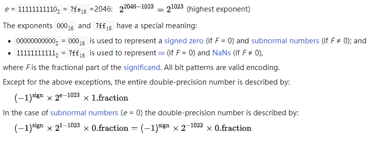

# Computer Science Tips

记录一些小知识点，供个人搜索使用。反正脑内记忆也会忘。

## Nan

真的float/double类型当然不会有nan，它就是个数字？但print float/double类型的时候，可能打印nan，它既不是最大值也不是最小值。C++中，构造如下：
    
```cpp
#include <iostream>   // std::cout
#include <string>     // std::string, std::to_string

int main ()
{
  double d = 0.0 / 0.0;
  std::cout << d << " " << std::to_string(d) << " " << std::numeric_limits<double>::max() + 1e308 << " " << 1.7e308 + 1e308 << std::endl;
  return 0;
}
```
应该只有/0的非法值能打印出nan吧，加大值再加一点溢出应该只会得到inf而不是nan。但它具体是个什么数字？查c++和java的文档，可以知道它是超出double正常值理解的一个值，https://en.cppreference.com/w/cpp/numeric/math/nan ，打印出其hex值，为7ff0000000000000。根据标准来读https://en.wikipedia.org/wiki/Double-precision_floating-point_format，可以使用转换工具，更容易懂，https://gregstoll.com/~gregstoll/floattohex/ ，1位S符号位是0正数，跟着11位作为指数E(Exponent)全1，10进制是2047，这个数定义是special的，读到了这个都会被认为是nan。后面52位都是fraction，记为F，F以1开头，不为0。



当E是全1时，会被拿来当作特殊数字，inf和nan，具体是谁，看F是否为0。可以看到E最大只能到1023，1024是不给用的。但都能存在double变量里。

但很离谱的是，rapidjson 1.0.2版里，如果double是nan，你write它成json，会得到怪东西。

## Union

union在json里还有妙用，印象中union是被拿来节约内存的，也知道如何计算占用内存，包括看最长的和padding。但其实没真正利用过它，不知道它的优雅用法，甚至有时候会误以为它是把几个变量用更紧凑的方式放在一起，好像是把union和struct记混了，因为struct考题会考到padding。注意区别，union是共用，struct是组合。

单说union在json中的应用，因为json的数字是没有类型的，特别的是，你认为json应该传入浮点数，但它传入整数，其实也是应该被允许的，`1`被当作`1.0`这很合理。所以，类似rapidjson就是用union来表示数字，其实无论数字大还是小，都存在一块内存里，读的时候再具体选union中的某个，实际就是在选不同的指针。
